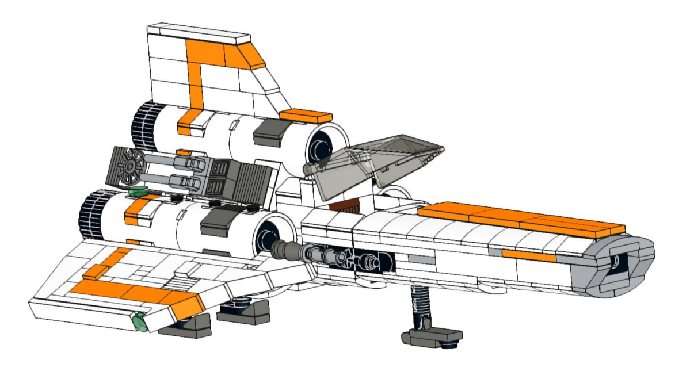

# LEGO MOC - Battlestar Galactica - Colonial Viper MK1 - White/Orange

# Credits

All credits for the original model go to [apenello @ rebrickable](https://rebrickable.com/users/apenello/mocs/)

# Based On

The White Orange Colonial Viper MK1 is derived from:

- [colonial-viper-mk1-version-20 @ rebrickable](https://rebrickable.com/mocs/MOC-45112/apenello/colonial-viper-mk1-version-20/#details)

- [colonial-viper-mk1-version-20-gray @ rebrickable](https://rebrickable.com/mocs/MOC-45867/apenello/colonial-viper-mk1-version-20-gray/#details)

- [colonial-viper-mk1-version-20-shadow-viper @ rebrickable](https://rebrickable.com/mocs/MOC-45258/apenello/colonial-viper-mk1-version-20-shadow-viper/#details)

The landing gear is derived from:

- [battlestar-galactica-mk1-colonial-viper-white-retired @ rebrickable](https://rebrickable.com/mocs/MOC-23012/apenello/battlestar-galactica-mk1-colonial-viper-white-retired/#details)

- [battlestar-galactica-mk1-colonial-viper-gray-retired @ rebrickable](https://rebrickable.com/mocs/MOC-24718/apenello/battlestar-galactica-mk1-colonial-viper-gray-retired/#details)

# Changes Compared to the Original Models

- Modeling done in [LEGO BrickLink Studio](https://www.bricklink.com/v3/studio/download.page)

- The main model consists of around 40 sub models

- The coloring has been changed to orange

- The instructions have been completely redone, to (imo) give a better building experience

- On many places in the model, additional bricks have been added, to (imo) provide better stability

- Especially the nose section was changed in many ways, making it (imo) much more robust

- Part count has gone up from just over 600, to 685

# Have Fun With the Building Instructions

- 20MB [LEGO PDF Instructions](./Colonial_Viper_MK1_V2pb_White_Orange.pdf?raw=true)

- Zipped [XML Upload File for BrickLink Wanted List](./Colonial_Viper_MK1_V2pb_White_Orange.BrickLink-Wanted-List.zip?raw=true)

# Some Photos

Can be accessed at [rebrickable.com](https://rebrickable.com/mocs/MOC-45112/apenello/colonial-viper-mk1-version-20/#photos)

# Some Comments on the Spare Parts

The last few pages of the instructions list some spare parts, they can be used for:

- 2 pieces of: 1x1 white tile, to replace the navigation lights at the end of the wings

- 4 pieces of: 1x1 dark bluish grey plate, to create sort of "wing marker/signature", as can be seen on the above mentioned photos, so that #1 and #2 Vipers can be distinguished

- 2 pieces of: 1x3 white brick, to remove the "wing marker/signature" parts, and to replace the **1 piece of 1x2 white brick** and **3 pieces of 1x1 white plate**, where the "wing marker/signature" is suggested

